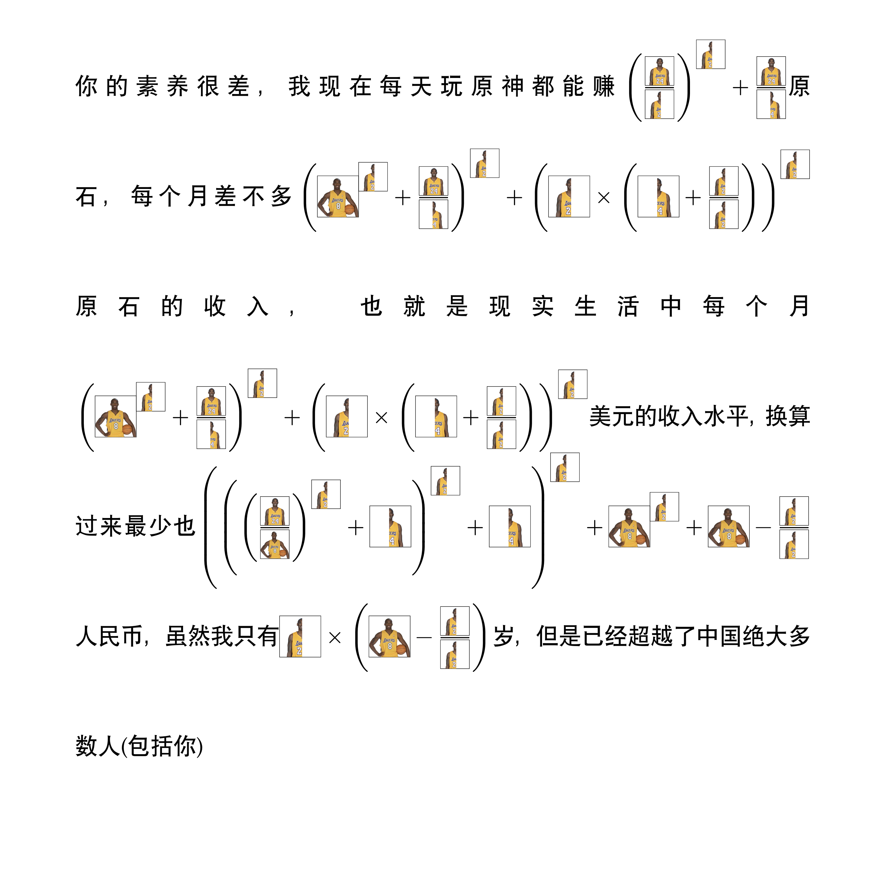
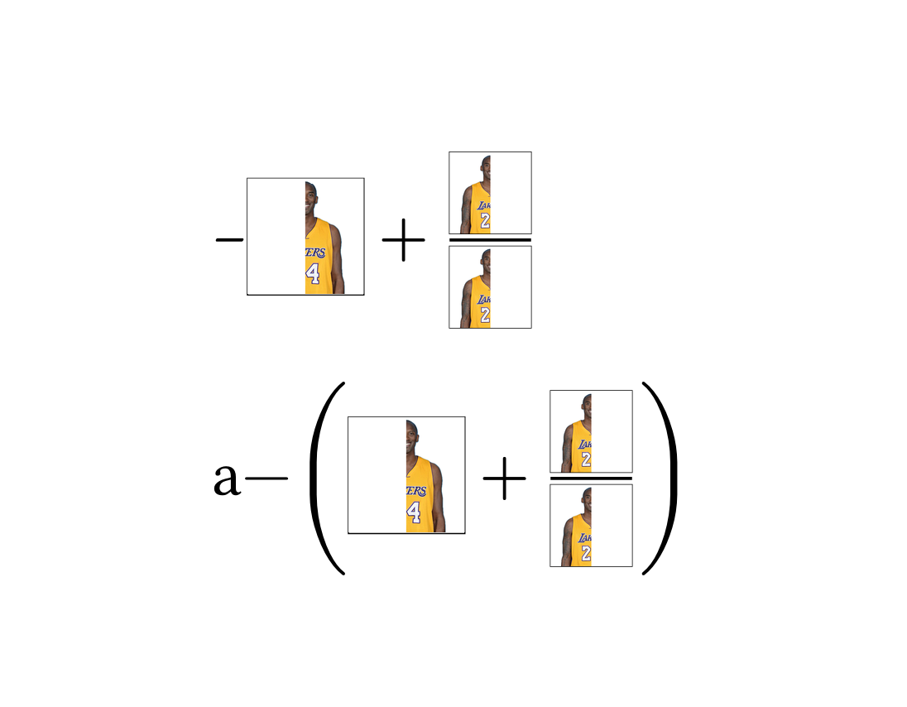

# Kobe numbers

让你的数字变成牢大！

## 使用方式

1. 在 [typst.app](https://typst.app/project/rT3g13QMFXfiUUq_iTpl8Q) 查看和编辑；
2. 在 [线上](https://youxam.github.io/kobe_numbers/) 生成和下载图片；
3. clone 本项目到本地，使用 [typst](https://typst.app/docs) 编译。

## 效果

对于数字 `100`：


对于一段文字：



## 已知的问题

对于负数，如果负号前为行首或者空白，无法正常转换，该问题是由于 Typst 的 bug([typst issue #86](https://github.com/typst/typst/issues/86))，在上游修复之前无法解决该问题。

```typst
#import "./kobe_numbers.typ": kobe_numbers
#show: kobe_numbers

#set page(height: auto, width: auto, margin: 0.5in)
#show par: set block(spacing: 3em)
#set par(justify: true, leading: 3em)

-3 // 无法正确添加括号

a-3 // 正常
```



