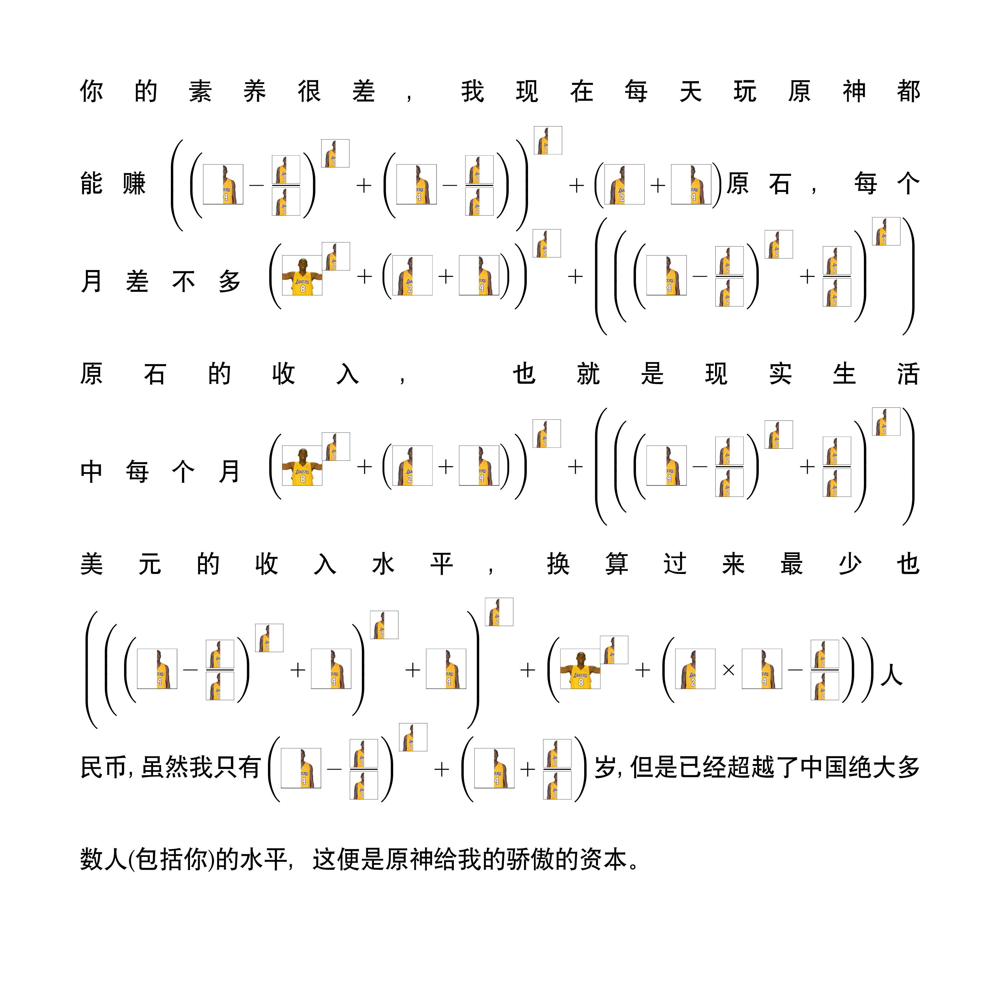

# Kobe numbers

让你的数字变成牢大！

## 使用方式

1. 在 [typst.app](https://typst.app/project/rT3g13QMFXfiUUq_iTpl8Q) 查看和编辑；
2. 在 [线上](https://youxam.github.io/kobe_numbers/) 生成和下载图片（不支持中文字体）；
3. clone 本项目到本地，使用 [typst](https://typst.app/docs) 编译。

## 效果

对于数字 `100`：

对于一段文字：

